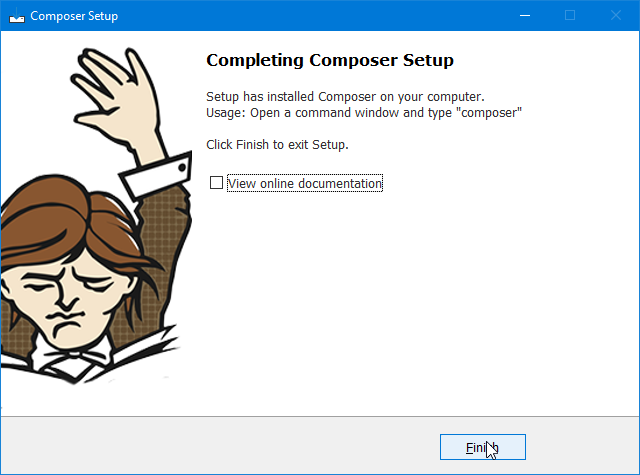

<a name="top"></a>

[<== Revenir à la page principale du projet](../../)

# Packages de base pour le développement

Afin de pouvoir développer dans de bonnes conditions, il est nécessaire d'installer quelques packages.

## Sommaire

- [1 - Liste des packages](#1---liste-des-packages)
- [1 - Sur Windows](#1---sur-windows)
- [2 - Sur Mac OS](#2---sur-mac-os)
- [3 - Sur Linux](#3---sur-linux)

## 1 - Liste des packages
[Haut de page](#top)

- Sur Windows
    - [1.1 - Insllation de Composer & Php & Xdebug](#11---insllation-de-composer--php--xdebug)
        - **php** & **xdebug** & **composer**
        - [1.1.1 - Télécharger PHP 8.1 et Composer pour Windows](#111---télécharger-php-81-et-composer-pour-windows)
        - [1.1.2 - Installation de PHP 8.1](#112---installation-de-php-81)
        - [1.1.3 - Installer Composer et ajouter PHP 8.1 au Path](#113---installer-composer-et-ajouter-php-81-au-path)
        - [1.1.4 - Installer Xedbug](#114---installer-xedbug)
        - [1.1.5 - Activer OPcache](#115---activer-opcache)
        - [1.1.6 - Vérifier l'installation de PHP 8.1 et Composer](#116---vérifier-linstallation-de-php-81-et-composer)
            - [1.1.6.1 - PHP 8.1](#1171---php-81)
            - [1.1.6.2 - Composer](#1172---composer)
- Sur Mac OS
    - [2.1 - Xcode](#21---xcode)
    - [2.2 - Homebrew](#22---homebrew)
    - [2.3 - Packages utiles](#23---packages-utiles)
        - Déjà sur Mac OS : **curl**
        - **zip** & **unzip** & **wget** & **nano** & **tree** & **git** & **gcc**
        - **composer** & **php** & **apcu** & **xdebug**
- Sur Linux
    - [3.1 - Présentation des scripts](#31---présentation-des-scripts)
        - **curl** & **wget** & **nano** & **zip** & **unzip** & **git** & **tree** & **libpcre3**
        - **python** & **c/c++** & **c#** & **java** & **nodejs** & **npm** & **php** & **composer** & **ruby**
    - [3.2 - Script d'installation des packages](#32---script-dinstallation-des-packages)
    - [3.3 - Script de vérification des packages installés](#33---script-de-vérification-des-packages-installés)
    - [3.4 - Script de désinstallation des packages](#34---script-de-désinstallation-des-packages)

## 1 - Sur Windows
[Haut de page](#top)

### 1.1 - Insllation de Composer & Php & Xdebug
[Haut de page](#top)

#### 1.1.1 - Télécharger PHP 8.1 et Composer pour Windows
[Haut de page](#top)

- Télécharger PHP 8.1 :
    - [Zip VS16 x64 Thread Safe](https://windows.php.net/download/).
- Télécharger Composer :
    - [Composer-Setup.exe](https://getcomposer.org/download/)

#### 1.1.2 - Installation de PHP 8.1
[Haut de page](#top)

Décompresser et copier les contenu de fichier **zip** dans un nouvau dossier : `C:\php\8.1.10`.

#### 1.1.3 - Installer Composer et ajouter PHP 8.1 au Path
[Haut de page](#top)

Executer le fichier **Composer-Setup.exe**


Choisissez votre choix d'installation.


Choisissez le mode **developper** si vous voulez plus 😉 (j'ai pas test encore, déso 😁).

.

Cela vous permettra d'accéder à Php via une console.


Non testé 🤷‍♂️😜.


Lance maintenant l'installation.



Voilà, c'est finis. 💪

#### 1.1.4 - Installer Xedbug
[Haut de page](#top)

Dans le git, je propose une dossier composé d'un fichier php chargé de la fonction `phpinfo()` dont à besion pour vérifié la version et l'installation de notre PHP.

Rener-vous dans le dossier :

```
> cd .\guide_php_composer_xdebug\phpinfo\
```

Lancer une petit serveur HTTP avec php pour pouvoir lire la configuration lu par `phpinfo()`.

```
> php -S localhost:8080
[Tue Sep 27 23:43:49 2022] PHP 7.4.26 Development Server (http://localhost:8080) started
[Tue Sep 27 23:43:53 2022] [::1]:2602 Accepted
[Tue Sep 27 23:43:53 2022] [::1]:2603 Accepted
[Tue Sep 27 23:43:53 2022] [::1]:2602 [200]: GET /
[Tue Sep 27 23:43:53 2022] [::1]:2602 Closing
[Tue Sep 27 23:43:55 2022] [::1]:2603 [404]: GET /sw.js - No such file or directory
[Tue Sep 27 23:43:55 2022] [::1]:2603 Closing
```

Une fois le serveur HTTP lancer, aller sur [http://localhost:8080](http://localhost:8080)

Voici une apperçu :


- Sélectionné toute la page avec : `CTRL` + `A`


- Copier toute la page avec : `CTRL` + `C`

- Aller sur [https://xdebug.org/wizard](https://xdebug.org/wizard)


- Coller toute la page avec : `CTRL` + `V`


- Suiver ensuite les instructions afficher.

Dans l'exemple :

- **Instructions** :
  1. Download **php_xdebug-3.1.5-7.4-vc15-x86_64.dll**
  2. Move the downloaded file to `c:\wamp64\bin\php\php7.4.26\ext`, and rename it to `php_xdebug.dll`
  3. Mettez à jour `C:\wamp64\bin\php\php7.4.26\php.ini` et ajouté la ligne : `zend_extension = xdebug`
  4. Redémarrer le serveur HTTP intégré de PHP : `php -S localhost:8080`


- Fichier téléchargé.


- Fichier renommé et déplacé.


- Ligne ajouté.

- Accès : [http://localhost:8080](http://localhost:8080)


Voilà, Xdebug est installé. 😎💪

#### 1.1.5 - Activer OPcache
[Haut de page](#top)

Rechercher `zend_extension` et si il y a un `;` devant `zend_extension=xdebug`, retirer le.

Vous dévrier obtenir cela :


Activer en retirant les `;` aux début des lignes :

```
opcache.memory_consumption=128
opcache.interned_strings_buffer=8
opcache.max_accelerated_files=4000
opcache.revalidate_freq=60
opcache.fast_shutdown=1
opcache.enable_cli=1
```


Voilàa, OPcache est activer 😉.

#### 1.1.6 - Vérifier l'installation de PHP 8.1 et Composer
[Haut de page](#top)

Ouvrer une console et effectuer les commandes suivantes :

- pour vérifier Php : `php -v`
- pour vérifier Cmposer : `composer -v`

##### 1.1.6.1 - PHP 8.1
[Haut de page](#top)

Si Php est bien installé, voici que votre console afficher :

```
> php -v
```

Si PHP est installé sans Xdebug et OPcache

```
PHP 8.1.10 (cli) (built: Aug 30 2022 18:05:49) (ZTS Visual C++ 2019 x64)
Copyright (c) The PHP Group
Zend Engine v4.1.10, Copyright (c) Zend Technologies
```

Si PHP est installé avec Xdebug et sans OPcache

```
PHP 7.4.26 (cli) (built: Nov 16 2021 18:15:31) ( ZTS Visual C++ 2017 x64 )
Copyright (c) The PHP Group
Zend Engine v3.4.0, Copyright (c) Zend Technologies
    with Xdebug v3.1.5, Copyright (c) 2002-2022, by Derick Rethans
```

Si PHP est installé avec Xdebug et OPcache

```
PHP 8.1.10 (cli) (built: Aug 30 2022 18:05:49) (ZTS Visual C++ 2019 x64)
Copyright (c) The PHP Group
Zend Engine v4.1.10, Copyright (c) Zend Technologies
    with Xdebug v3.1.5, Copyright (c) 2002-2022, by Derick Rethans
    with Zend OPcache v8.1.10, Copyright (c), by Zend Technologies
```

##### 1.1.6.2 - Composer

```
> composer -v
   ______
  / ____/___  ____ ___  ____  ____  ________  _____
 / /   / __ \/ __ `__ \/ __ \/ __ \/ ___/ _ \/ ___/
/ /___/ /_/ / / / / / / /_/ / /_/ (__  )  __/ /
\____/\____/_/ /_/ /_/ .___/\____/____/\___/_/
                    /_/
Composer version 2.4.2 2022-09-14 16:11:15

Usage:
  command [options] [arguments]

Options:
  -h, --help                     Display help for the given command. When no command is given display help for the list command
  -q, --quiet                    Do not output any message
  -V, --version                  Display this application version
      --ansi|--no-ansi           Force (or disable --no-ansi) ANSI output
  -n, --no-interaction           Do not ask any interactive question
      --profile                  Display timing and memory usage information
      --no-plugins               Whether to disable plugins.
      --no-scripts               Skips the execution of all scripts defined in composer.json file.
  -d, --working-dir=WORKING-DIR  If specified, use the given directory as working directory.
      --no-cache                 Prevent use of the cache
  -v|vv|vvv, --verbose           Increase the verbosity of messages: 1 for normal output, 2 for more verbose output and 3 for debug

Available commands:
  about                Shows a short information about Composer
  archive              Creates an archive of this composer package
  audit                Checks for security vulnerability advisories for installed packages
  browse               [home] Opens the package's repository URL or homepage in your browser
  bump                 Increases the lower limit of your composer.json requirements to the currently installed versions
  check-platform-reqs  Check that platform requirements are satisfied
  clear-cache          [clearcache|cc] Clears composer's internal package cache
  completion           Dump the shell completion script
  config               Sets config options
  create-project       Creates new project from a package into given directory
  depends              [why] Shows which packages cause the given package to be installed
  diagnose             Diagnoses the system to identify common errors
  dump-autoload        [dumpautoload] Dumps the autoloader
  exec                 Executes a vendored binary/script
  fund                 Discover how to help fund the maintenance of your dependencies
  global               Allows running commands in the global composer dir ($COMPOSER_HOME)
  help                 Display help for a command
  init                 Creates a basic composer.json file in current directory
  install              [i] Installs the project dependencies from the composer.lock file if present, or falls back on the composer.json
  licenses             Shows information about licenses of dependencies
  list                 List commands
  outdated             Shows a list of installed packages that have updates available, including their latest version
  prohibits            [why-not] Shows which packages prevent the given package from being installed
  reinstall            Uninstalls and reinstalls the given package names
  remove               Removes a package from the require or require-dev
  require              [r] Adds required packages to your composer.json and installs them
  run-script           [run] Runs the scripts defined in composer.json
  search               Searches for packages
  self-update          [selfupdate] Updates composer.phar to the latest version
  show                 [info] Shows information about packages
  status               Shows a list of locally modified packages
  suggests             Shows package suggestions
  update               [u|upgrade] Updates your dependencies to the latest version according to composer.json, and updates the composer.lock file        
  validate             Validates a composer.json and composer.lock
```

## 2 - Sur Mac OS
[Haut de page](#top)

Voici une liste de packages utiles pour le développement sur **Mac OS** :

- [2.1 - Xcode](#21---xcode)
- [2.2 - Homebrew](#22---homebrew)
- [2.3 - Packages utiles](#23---packages-utiles)

### 2.1 - Xcode
[Haut de page](#top)

Sur Mac OS, il est nécessaire d'installer **Xcode** pour pouvoir installer **Homebrew** ou la plupart des packages.

Télécharger **Xcode** sur l'App Store, puis lancez-le et suivez les instructions.

Ensuite, il est nécessaire d'installer les outils en ligne de commande :

```
xcode-select --install
```

### 2.2 - Homebrew
[Haut de page](#top)

_**A - Qu'est-ce que ?**_

**Homebrew** est un gestionnaire de paquets pour macOS, tous est détaillé [ici](https://brew.sh/index_fr).

_**B - Installation**_

Pour installer homebrew, il suffit d'executer la comande ci-dessous :

```
/bin/bash -c "$(curl -fsSL https://raw.githubusercontent.com/Homebrew/install/HEAD/install.sh)"
```

_**C - Installer un paquet**_

Voici la commande :

```
brew install <paquet>
```

Un nombre important de paquets est disponible, il suffit de taper `brew search` pour avoir la liste ou de consulter La liste des paquets disponible [ici](https://formulae.brew.sh/formula/).

### 2.2 - Packages utiles
[Haut de page](#top)

Voici une suite commande pour installer plusieurs paquets utiles pour le développement :

```
brew install zip unzip wget nano tree git gcc
brew install composer php@7.2 php@7.3 php@8.0 php@8.3
pecl install apcu xdebug zip
```

- Via **brew** - Un gestionnaire de paquets pour macOS
    - `zip` - est un outil de compression de données
    - `wget` - est un récupérateur de fichiers Internet
    - `nano` - est un éditeur de texte gratuit exécutable dans le terminal
    - `tree` - permet d'afficher les répertoires sous forme d'arborescences (avec sortie couleur/HTML en option)
    - `git` - est un logiciel de gestion de versions décentralisé
    - `gcc` - est un compilateur C et C++
    - `php` - est un langage de programmation libre, principalement utilisé pour produire des pages Web dynamiques via un serveur HTTP
        - Pour les versions de PHP à installer, il est nécessaire de de vérifier la disponibilité des paquets sur le liste des paquets Php disponible [ici](https://formulae.brew.sh/formula/php). Les versions disponibles à ce jour sont : `7.2`, `7.3`, `8.0`, `8.3`
- Via **pecl** - Un gestionnaire de paquets pour PHP
    - `apcu` - est un système de cache de données en mémoire pour PHP
    - `xdebug` - est un débogueur pour PHP


## 3 - Sur Linux
[Haut de page](#top)

Pour Linux, j'ai ancienement préparer plusieurs petits scripts d'installation de packages pour **Ubuntu**. Testé pour la version **22.04**, mais il est nécessaire de les testés pour les autres versions.

### 3.1 - Présentation des scripts

Le script principal a pour but d'installer tous les outils nécessaires au développement sur Ubuntu 22.04 selon les besoins de l'utilisateur.
<br/>Il installe les paquets et kits de développement suivants :
- les outils de ligne de commandes
  - de curl & wget (permet de gérer les téléchargements)
  - de nano (permet de gérer les fichiers)
  - de zip & unzip (permet de gérer les archives)
  - de git (permet de gérer les dépôts git)
  - de tree (permet de visualiser les dossiers sous forme d'arbre)
  - de libpcre3 (permet de gérer les expressions régulières)
- les kits de développement
  - de Python ***(latest)***
  - de C / C++ ***(latest)***
  - de C# ***(latest)***
  - de Java ***(latest LTS)***
  - de NodeJS & NPM
  - de PHP
    - **7.4** ou **latest**
    - avec **Xdebug** && **OPCache**
    - avec **Composer**
  - de Ruby

Pour les utilisers, cloner le git sur votre machine et effectuer suiver les instructions ci-dessous.

> **NB :**
> - Les scripts sont disponibles dans le dossier `/scripts/installer/`.
> - Les scripts sont à lancer en tant qu'utilisateur `root`.

### 3.2 - Script d'installation des packages

Voici le script à lancer :

> Si ne c'est pas le cas, aller avant dans le dossier `/scripts/installer/` et lancer la commande ci-dessous :

```
sudo sh ubuntu_install_full.sh                  
```

### 3.3 - Script de vérification des packages installés

Le script ci-dessous désinstallera tous les outils installés dans la liste décrite en haut de la description.

> Si ne c'est pas le cas, aller avant dans le dossier `/scripts/installer/` et lancer la commande ci-dessous :

```
sudo sh ubuntu_check_version.sh
```

### 3.4 - Script de désinstallation des packages

Le script ci-dessous désinstallera tous les outils installés dans la liste décrite en haut de la description.

> Si ne c'est pas le cas, aller avant dans le dossier `/scripts/installer/` et lancer la commande ci-dessous :

```
sudo sh ubuntu_uninstall_full.sh
```