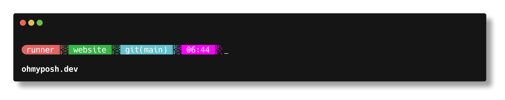
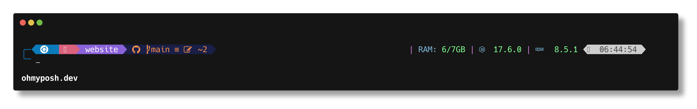

<a name="top"></a>

[<== Revenir à la page principale du projet](../../)

# Oh My Posh ! Personnalisation du terminal

## Sommaire

- [1 - Installation des Fonts nécessaires](#1---installation-des-fonts-nécessaires)
- [2 - Installation de Oh My Posh sur Windows](#1---sur-windows)
- [3 - Installation de Oh My Posh Sur Mac OS](#2---sur-mac-os)
- [4 - Installation de Oh My Posh Sur Linux](#3---sur-linux)
- [5 - Exemples de thèmes Oh My Posh](#4---exemples-de-thèmes-oh-my-posh)

## 1 - Installation des Fonts nécessaires

Pour pouvoir utiliser Oh My Posh, il faut installer une police de caractère compatible.
Celle-ci est téléchargeable [ici](https://github.com/ryanoasis/nerd-fonts/releases/download/v2.1.0/Meslo.zip).

> Si non, aller sur la partie Fonts de [Oh My Posh](https://ohmyposh.dev/docs/installation/fonts)

Puis, il est nécessaire de configurer la police du **terminal** pour qu'il utilise la police **Meslo LGL NF**.


> **NB :** Sur Mac OS, Oh My Posh est compatible avec le terminal par défaut, mais il est recommandé d'utiliser **iTerm2** ou tout autre terminal macOS moderne **prenant en charge les caractères ANSI**.

## 2 - Installation de Oh My Posh sur Windows
[Haut de page](#top)

_**Installation**_

Ouvrez une invite PowerShell et exécutez la commande suivante :

```
winget install JanDeDobbeleer.OhMyPosh -s winget
```

Cela installe quelques éléments :

- `oh-my-posh.exe` - Exécutable Windows
- `themes` - Les derniers thèmes Oh My Posh

Pour que le `PATH` rechargement soit effectué, un redémarrage de votre terminal est conseillé.

_**Vérifier la présences des thèmes**_

```
~\AppData\Local\Programs\oh-my-posh\themes

OU

C:\Users\<user>\AppData\Local\Programs\oh-my-posh\themes
```

_**Préparer le lien avec le thème

```
~\AppData\Local\Programs\oh-my-posh\themes\jandedobbeleer.omp.json

OU

C:\Users\<user>\AppData\Local\Programs\oh-my-posh\themes\jandedobbeleer.omp.json
```

_**Activer un thème**_

Ouvrir le `$PROFILE` de votre terminal :

```
notepad $PROFILE
```

Ajouter dedans :

```
oh-my-posh --init --shell pwsh --config ~\AppData\Local\Programs\oh-my-posh\themes\jandedobbeleer.omp.json | Invoke-Expression
```

Sauvegarder et fermer **notepad**.

Relancer ensuite le terminal.

Et voilà, maintenant kiffer 😎.

_**Installer de nouveau thèmes**_

Pour ajouter un thème, faite la commande `oh-my-posh font install <theme>`.

Exemple :

```
oh-my-posh font install jandedobbeleer
```

## 2 - Installation de Oh My Posh sur Mac OS
[Haut de page](#top)

_**Télécharger iTerm2**_

Comme le terminal standard a des problèmes pour afficher correctement les caractères ANSI, nous vous conseillons d'utiliser iTerm2 ou tout autre terminal macOS moderne prenant en charge les caractères ANSI.

- [iTerm2](https://iterm2.com/)

_**Installation**_

```
brew install oh-my-posh
brew install jandedobbeleer/oh-my-posh/oh-my-posh
brew update && brew upgrade && exec zsh
```

_**Configuration de `.zshrc`**_

Ajoutez ce qui suit à `~/.zshrc` :

```
if [ $TERM_PROGRAM != "Apple_Terminal" ]; then
  eval "$(oh-my-posh init zsh)"
fi
```

Et voilà, maintenant kiffer 😎.

_**Désintallation**_

```
brew remove oh-my-posh                                                                                  in zsh at 16:53:08
brew remove jandedobbeleer/oh-my-posh/oh-my-posh
brew update && brew upgrade && exec zsh
```

## 3 - Installation de Oh My Posh sur Linux
[Haut de page](#top)

_**A venir...**_

## 4 - Exemples de thèmes Oh My Posh

Quelques thèmes sympa en exemple - [Haut de page](#top) <a name="3"></a>

Quelques sympa :

- [blue-owl](https://ohmyposh.dev/docs/themes#blue-owl)


- [blueish](https://ohmyposh.dev/docs/themes#blueish)


- [bubbles](https://ohmyposh.dev/docs/themes#bubbles)


- [bubblesextra](https://ohmyposh.dev/docs/themes#bubblesextra)


- [bubblesline](https://ohmyposh.dev/docs/themes#bubblesline)


- [catppuccin](https://ohmyposh.dev/docs/themes#catppuccin)


- [cert](https://ohmyposh.dev/docs/themes#cert)


- [chips](https://ohmyposh.dev/docs/themes#chips)


- [clean-detailed](https://ohmyposh.dev/docs/themes#clean-detailed)


- [cobalt2](https://ohmyposh.dev/docs/themes#cobalt2)


- [dracula](https://ohmyposh.dev/docs/themes#dracula)


- [easy-term](https://ohmyposh.dev/docs/themes#easy-term)


- [emodipt-extend](https://ohmyposh.dev/docs/themes#emodipt-extend)


- [emodipt](https://ohmyposh.dev/docs/themes#emodipt)


- [jandedobbeleer](https://ohmyposh.dev/docs/themes#jandedobbeleer)


- [the-unnamed](https://ohmyposh.dev/docs/themes#the-unnamed)


Liste de thèmes [ici](https://ohmyposh.dev/docs/themes).