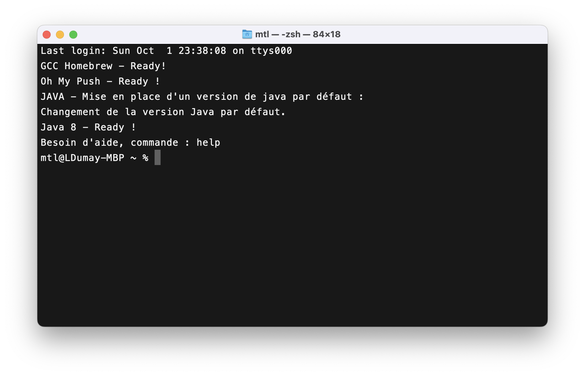
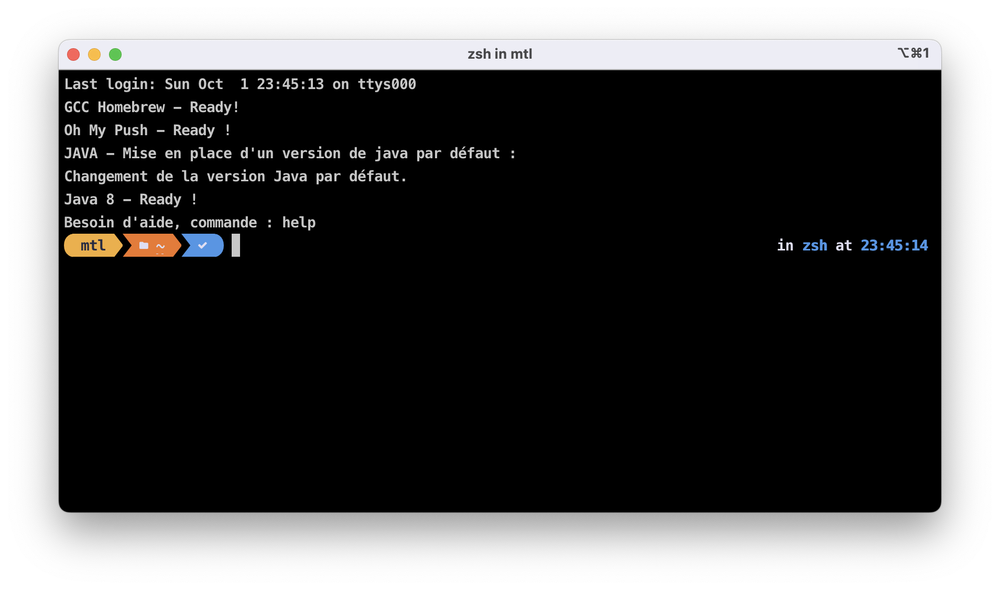
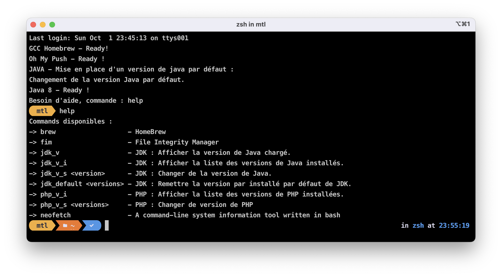

<a name="top"></a>

[<== Revenir à la page principale du projet](../../)

# Ajout d'options du terminal

## Sommaire

- [1 - Sur Windows](#1---sur-windows)
- [2 - Sur Mac OS](#2---sur-mac-os)
- [3 - Sur Linux](#3---sur-linux)

## 1 - Sur Windows
[Haut de page](#top)

_**A venir...**_

## 2 - Sur Mac OS
[Haut de page](#top)

### 2.1 - Ma proposition de personnalisation du terminal

> **Attention** : De nombreux paquets sont nécessaires pour pouvoir utiliser cette configuration, tel que :
> - HomeBrew
> - Oh My Posh
> - Java : JDK 8, 11, 17, 19
> - PHP
> - Python
> - GCC
> - Fim (File Integrity Manager)

Editier le fichier `~/.zshrc` (ou créer le si il n'existe pas) et ajouter les lignes suivantes :

```bash
# - - - [Path - Local] - - - 
export PATH="/usr/local/sbin:$PATH"


# - - - [Path - Java] - - - 
export JAVA_HOME=/Library/Java/JavaVirtualMachines/jdk1.8.0_111.jdk/Contents/Home
#export JAVA_HOME=/Users/mtl/Library/Java/JavaVirtualMachines/corretto-11.0.16/Contents/Home
#export JAVA_HOME=/Users/mtl/Library/Java/JavaVirtualMachines/corretto-17.0.5/Contents/Home
#export JAVA_HOME=/Users/mtl/Library/Java/JavaVirtualMachines/corretto-19.0.1/Contents/Home


# - - - [Path -  Php] - - -
#export PATH="/usr/local/opt/php@7.1/bin:$PATH"
#export PATH="/usr/local/opt/php@7.1/sbin:$PATH"


# - - - [Path - Python] - - -
export PATH="/Library/Frameworks/Python.framework/Versions/3.10/bin:$PATH"


# - - - [Path - Fim] - - -
export PATH="/Users/mtl/file_integrity_manager/:$PATH"


# - - - [GCC - Configration] - - -
# Choose the directory containing the latest version of GCC
# as indicated by the highest number suffixed to 
# the filepath of the package directory
print -v version /usr/local/opt/gcc@<->(n[-1])
version=${version#*@}
for file in /usr/local/opt/gcc@${version}/bin/*-${version}(*); do
    tail=${file:t}
    ln -sf ${file} /usr/local/bin/${tail%-*}
done

#Pour vérifié la source de gcc
# - gcc - MacOS_Clang: /usr/bin/gcc
# - gcc - Homebrew : /usr/local/bin/
# -- Pour checker : ls /usr/local/bin/ | grep "gcc*"

echo "GCC Homebrew - Ready!"


# - - - [Fonction d'affichage de l'aide ZSHRC personnalisé] - - -
help() {
	echo "Commands disponibles :"
	echo "-> brew                   - HomeBrew"
	echo "-> fim                    - File Integrity Manager"
	echo "-> jdk_v                  - JDK : Afficher la version de Java chargé."
	echo "-> jdk_v_i                - JDK : Afficher la liste des versions de Java installés."
	echo "-> jdk_v_s <version>      - JDK : Changer de la version de Java."
	echo "-> jdk_default <versions> - JDK : Remettre la version par installé par défaut de JDK."
	echo "-> php_v_i                - PHP : Afficher la liste des versions de PHP installées."
	echo "-> php_v_s <versions>     - PHP : Changer de version de PHP"
	echo "-> neofetch               - A command-line system information tool written in bash"
}


# - - - [Fonction - Afficher la version de Java chargé dans le terminal] - - -
jdk_v() {
	echo "Version de Java chargé."
	java -version
}


# - - - [Fonction - Afficher la liste des versions de Java installés] - - -
jdk_v_i() {
	echo "List des version de versions de Java installés."
	/usr/libexec/java_home -V
}


# - - - [Fonction - Changer de version de Java] - - -
jdk_v_s() {
	echo "Changement de la version Java."
	version=$1
	unset JAVA_HOME;
	export JAVA_HOME=$(/usr/libexec/java_home -v"$version");
	java -version
}

# - - - [Fonction - Met une version de Java choisi par défaut dans le terminal au démarrage] - - -
jdk_default() {
	echo "Changement de la version Java par défaut."
	version=$1
	unset JAVA_HOME;
	export JAVA_HOME=$(/usr/libexec/java_home -v"$version");
	echo "Java 8 - Ready !"
}

# - - - [Fonction - Afficher la liste des versions de PHP installées] - - -
php_v_i(){
	echo "Liste des versions de PHP installées."
	echo "--> dossier : /usr/local/Cellar/"
	ls /usr/local/Cellar/ | grep "php@"
	echo "--> dossier : /usr/local/opt/"
	ls /usr/local/opt/ | grep "php@"
}

# - - - [Fonction - Changer de version de PHP] - - -
php_v_s(){
	echo "Changement de la version de PHP."
	version=$1
	brew link --overwrite --force php@$version
	php -v
	echo "La version $version de PHP a bien été chargé."
}


# - - - [Active - Oh My Push] - - -
if [ $TERM_PROGRAM != "Apple_Terminal" ]; then
  eval "$(oh-my-posh init zsh)"
fi


# - - - [Active - Message] - - -
echo "Oh My Push - Ready !"
echo "JAVA - Mise en place d'un version de java par défaut :" 
jdk_default 1.8.0_333
echo "Besoin d'aide, commande : help"
```

Une fois ajouter, sauvegarder et fermer le fichier.
Puis relancer le terminal. Vous devriez obtenir :



_Version **Terminal** de Mac OS._



_Version **iTerm2** de Mac OS._

Celui permet d'effectuer de nombreuses actions :



## 3 - Sur Linux
[Haut de page](#top)

_**A venir...**_