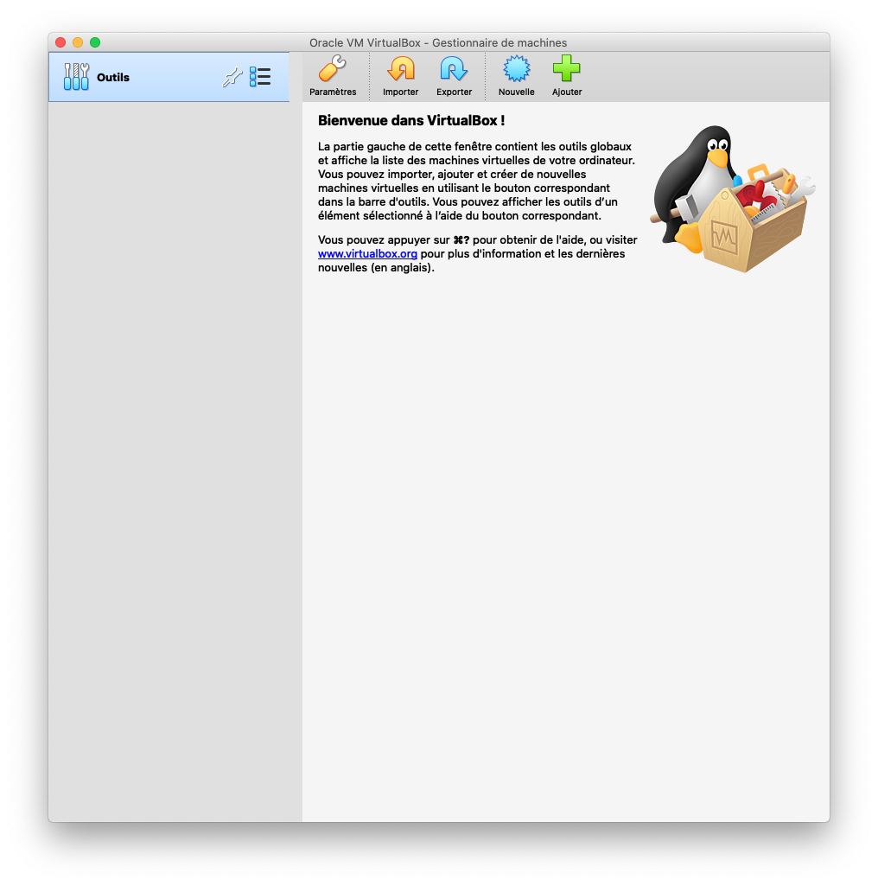
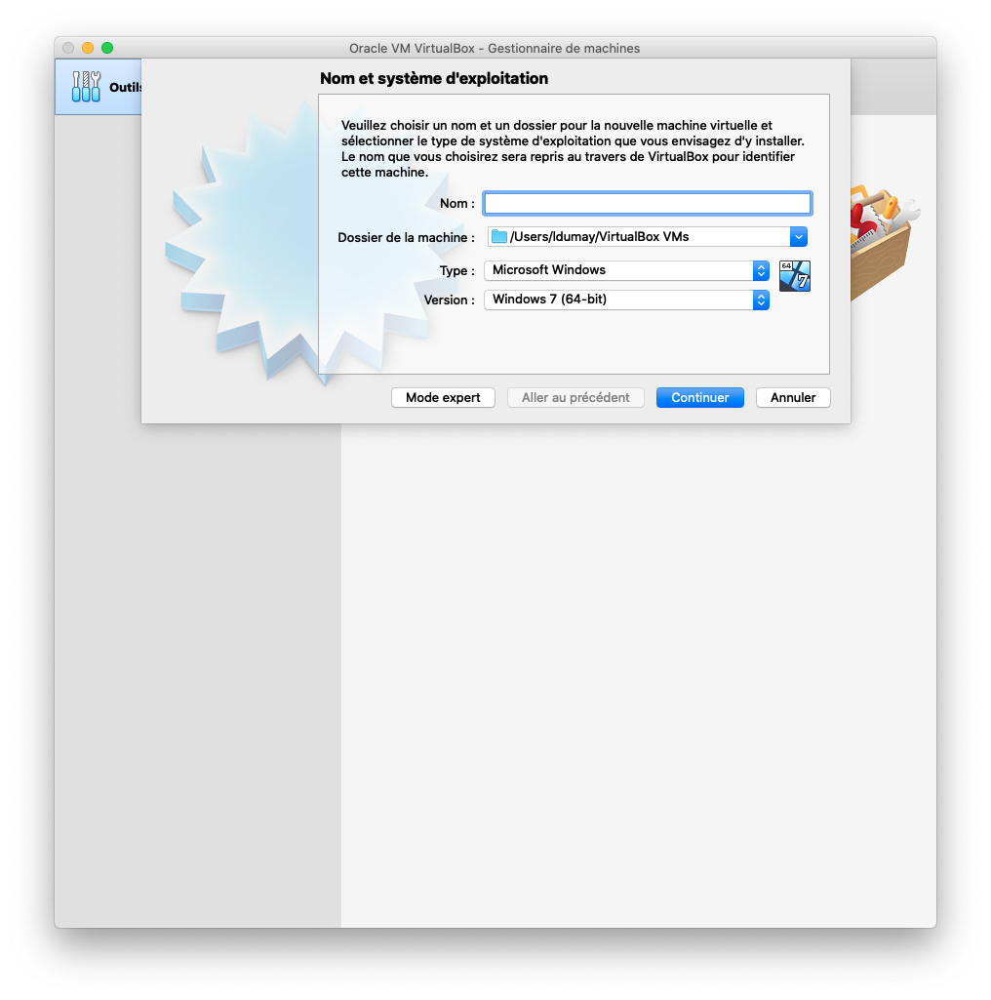
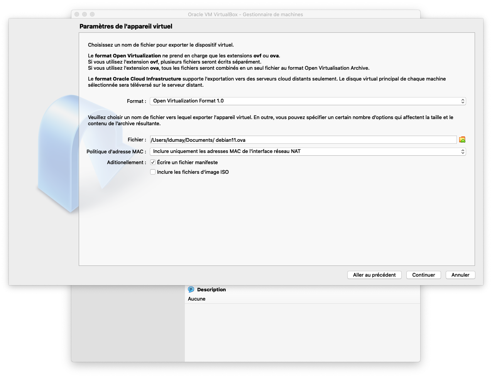

[<== Revenir à la page principale du projet](../../)

# Virtualbox

Ce guide à pour but de vous aider _(à installer et)_ utiliser Virtualbox.

## Créer une machine virtuelle

## Exporter une machine virtuelle

